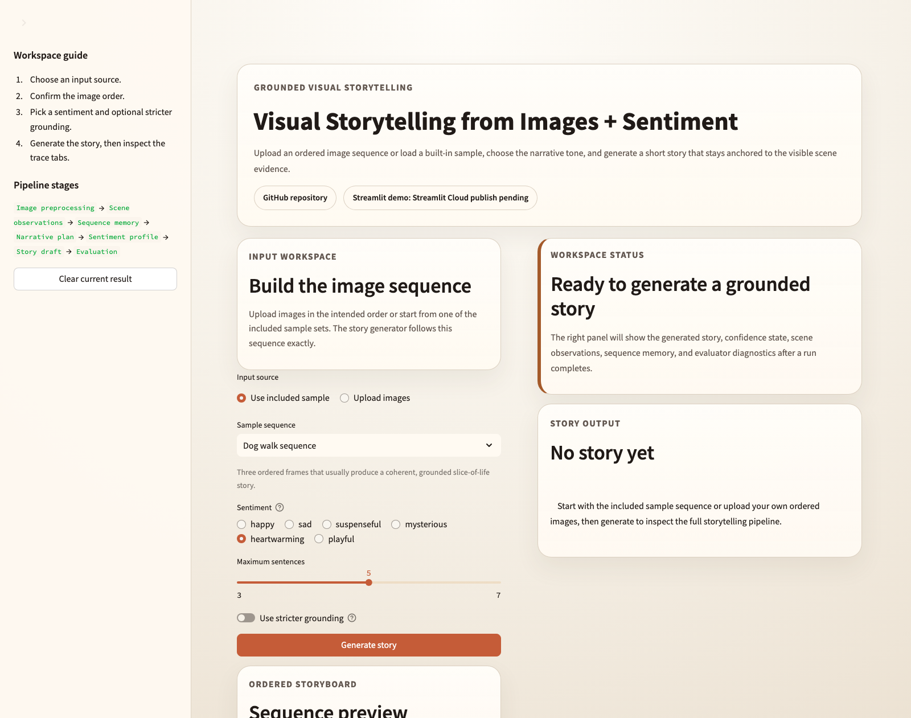
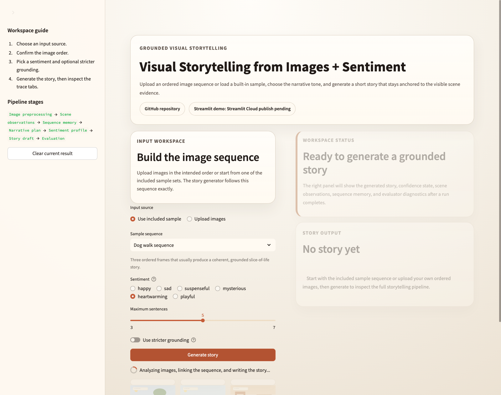
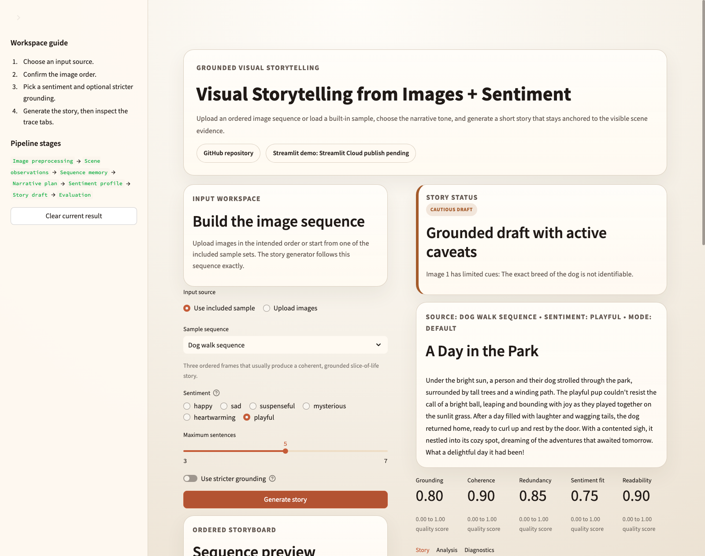
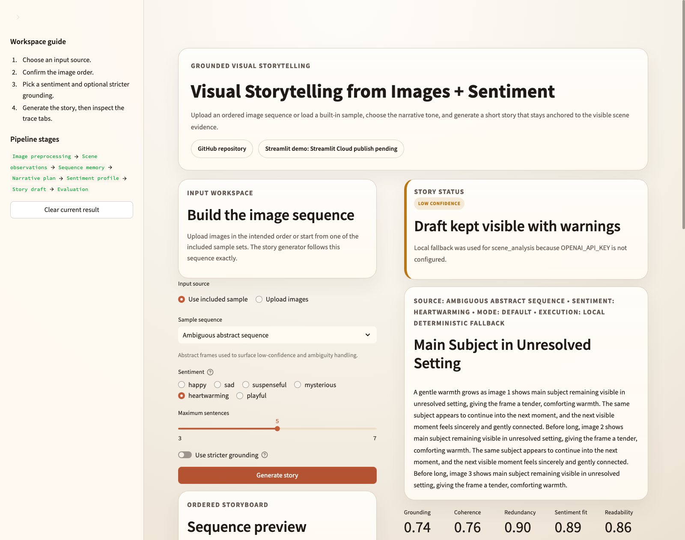
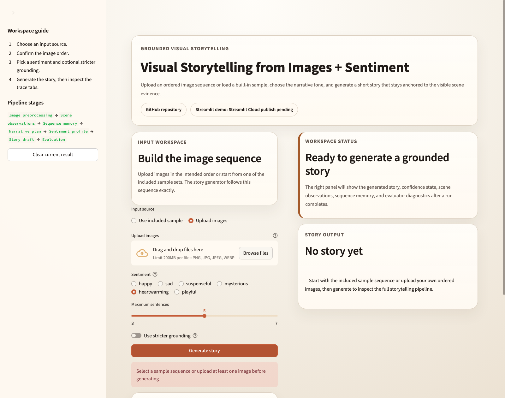

# Visual Storytelling from Images + Sentiment

[GitHub Repository](https://github.com/soobincho-gif/SentimentAnalysis_3) · [Temporary Live Streamlit Preview](http://147.47.7.75:8511) · [Submission Notebook](submission_package/%EC%8B%A4%EC%8A%B53_%EC%A1%B0%EC%88%98%EB%B9%88.ipynb)

Visual Storytelling from Images + Sentiment is a grounded multimodal storytelling system. A user provides an ordered sequence of images, chooses a sentiment, and the app turns that sequence into a short story while keeping the reasoning trace visible: image preprocessing preserves order, scene analysis extracts what is actually visible, sequence linking builds continuity across frames, the sentiment controller shapes tone without changing facts, and the evaluator checks whether the final story still reads as grounded, coherent, and non-redundant.

## Temporary live preview

- Current session preview: [http://147.47.7.75:8511](http://147.47.7.75:8511)
- Permanent Streamlit Community Cloud publish: deployment-ready, but creating the final `streamlit.app` URL still requires the repository owner to sign in and connect the repository in Streamlit Community Cloud.

## Problem and motivation

Naive image-to-story prompting usually fails in one of four ways:

- it treats each image like an isolated caption instead of a sequence,
- it invents details that are not visible,
- it lets tone overpower truth,
- it produces fluent text without any transparent way to inspect how the story was assembled.

This project is designed to solve those problems with a staged pipeline instead of a single prompt. The goal is not only to produce a pleasant short story, but to make the storytelling process traceable, revisable, and strong enough to support both a polished submission app and a deployment-facing Streamlit surface.

The expected user experience is simple:

1. choose or upload images in order,
2. select a sentiment,
3. generate a short story,
4. inspect the scene observations, sequence memory, and evaluator diagnostics when needed.

## Main features

- Ordered multi-image storytelling: the system preserves the image order and uses it as narrative sequence, not just as a batch of unrelated frames.
- Sentiment-controlled generation: `happy`, `sad`, `suspenseful`, `mysterious`, `heartwarming`, and `playful` adjust style, pacing, and closure while leaving factual grounding intact.
- Structured intermediate representations: `SceneObservation`, `SequenceMemory`, `NarrativePlan`, `SentimentProfile`, `StoryDraft`, and `EvaluationReport` keep stage boundaries explicit.
- Grounded story generation: the story is generated from observations and sequence memory rather than from raw images alone.
- Confidence-aware result rendering: the UI differentiates between story-ready, cautious, low-confidence, and blocked states instead of presenting every run as equally trustworthy.
- Diagnostics and trace views: Streamlit exposes analysis, sequence memory, evaluation metrics, provider execution mode, and grounding notes. The Gradio submission app adds an analysis-correction workflow on top of the same pipeline.
- Graceful fallback behavior: the app can still run without `OPENAI_API_KEY` by using deterministic local fallback logic, which is especially useful for deployment stability and documentation screenshots.

## System architecture

```mermaid
flowchart LR
    A["User input<br/>ordered images + sentiment"] --> B["UI surface<br/>Streamlit or submission app"]
    B --> C["Image preprocessing service"]
    C --> D["Scene analysis service"]
    D --> E["Optional observation overrides<br/>(submission app correction pass)"]
    E --> F["Sequence linking service"]
    F --> G["Narrative planning service"]
    G --> H["Sentiment control service"]
    H --> I["Story generation service"]
    I --> J["Evaluation service"]
    J --> K{"Flags remain?"}
    K -->|Yes| I
    K -->|No| L["Final story result<br/>story, story map, diagnostics"]
```



### Why the architecture looks like this

- Facts come before narration: the system extracts visible entities, settings, actions, and uncertainty notes before it tries to write a story.
- Sequence is a first-class concern: recurring entities and setting progression are stored in sequence memory so the story can link frames naturally.
- Sentiment is applied as style, not truth: the sentiment profile influences tone, pacing, and ending style without authorizing unsupported claims.
- Evaluation sits inside the loop: a fluent draft is not automatically acceptable, so the evaluator can push the generator through a limited revision loop.

## Design decisions and implementation logic

### UI structure

The Streamlit app is split into a left input workspace and a right result workspace so the sequence-building step and the story-reading step remain visually distinct. The same repository also includes a Gradio submission app at [`submission/app.py`](/Users/sarahc/Downloads/SentimentAnalysis_3/submission/app.py), which exposes richer analysis correction and regeneration flows while keeping the actual business logic inside `packages/`.

### Generation flow

The flow is deliberately staged:

1. preprocess images and preserve order,
2. analyze each image into typed observations,
3. build sequence memory across frames,
4. create a narrative plan,
5. resolve the selected sentiment into a profile,
6. generate the story,
7. evaluate grounding, coherence, redundancy, readability, and sentiment fit,
8. revise only if the evaluator still raises issues.

### State handling

The Streamlit layer keeps only lightweight UI state in `st.session_state`: current inputs, the latest result payload, last run signature, and the current confidence banner. All storytelling logic remains in the shared pipeline and service modules.

### Confidence, warning, and error states

- `Story ready`: clear run without unresolved issues.
- `Cautious draft`: readable story with limited caveats, such as provider-backed uncertainty notes.
- `Low confidence`: fallback-heavy or ambiguity-heavy run that should stay visible with warnings rather than be framed as final.
- `Blocked`: missing input or runtime failure before a valid result exists.

### Corrected analysis and stricter grounding

The repository already supports two refinement tracks:

- corrected analysis flow: in the Gradio submission app, users can save per-image observation overrides and regenerate from corrected analysis,
- stricter grounding flow: the generator uses a more conservative mode that prefers literal transitions and surfaces warnings if stricter thresholds are still not met.

### Implementation evolution

The current repo reflects an iterative progression rather than a one-shot build:

- documentation-first architecture and package boundaries,
- typed contracts for every major pipeline handoff,
- sequence-linking and evaluation improvements,
- submission-layer UI polish and regression coverage,
- Streamlit deployment surface, example assets, screenshots, and a polished notebook package.

That evolution is recorded in [`projects/visual-storytelling/TASKS.md`](/Users/sarahc/Downloads/SentimentAnalysis_3/projects/visual-storytelling/TASKS.md) and the dated `logs/` folders.

## Expected outputs and example results

### Provider-backed reference result

Example title: `A Day in the Park`

Example excerpt:

```text
On a sunny afternoon, a person and their dog strolled through the park, surrounded by trees and a winding path.
After their walk, the dog joyfully chased a ball, basking in the warmth of the sun and the thrill of play.
As the sun began to set, they returned home, the dog curling up peacefully by the door, content and tired.
```

Example diagnostics from the saved run:

- provider execution mode across all stages,
- grounding score `0.80`,
- coherence score `0.90`,
- no evaluator flags,
- revision attempts `0`.

### Low-confidence fallback result

Example title: `Main Subject in Unresolved Setting`

Example behavior:

- the app still returns a story,
- the banner explicitly marks the run as low confidence,
- provider execution switches to `local_fallback`,
- ambiguity and evidence limits remain visible in the diagnostics panel.

### Stricter grounding comparison

The saved strict run shows why the stricter mode exists: it reduces unsupported bridge language, but it also makes the system more willing to stop at an honest warning state when the stricter thresholds are not satisfied.

## Screenshots

### Streamlit workflow states

| Idle workspace | Generation in progress |
|---|---|
|  |  |

| Successful generation result | Low-confidence result |
|---|---|
|  |  |

### Blocked input state



The screenshot set is backed by the same example assets stored under [`assets/raw_samples/`](/Users/sarahc/Downloads/SentimentAnalysis_3/assets/raw_samples) and by saved execution artifacts in [`assets/example_runs/`](/Users/sarahc/Downloads/SentimentAnalysis_3/assets/example_runs).

## Submission package

The final submission package lives under [`submission_package/`](/Users/sarahc/Downloads/SentimentAnalysis_3/submission_package).

- Notebook: [`submission_package/실습3_조수빈.ipynb`](/Users/sarahc/Downloads/SentimentAnalysis_3/submission_package/%EC%8B%A4%EC%8A%B53_%EC%A1%B0%EC%88%98%EB%B9%88.ipynb)
- Support assets: [`assets/raw_samples/`](/Users/sarahc/Downloads/SentimentAnalysis_3/assets/raw_samples), [`assets/screenshots/`](/Users/sarahc/Downloads/SentimentAnalysis_3/assets/screenshots), [`assets/example_runs/`](/Users/sarahc/Downloads/SentimentAnalysis_3/assets/example_runs), [`assets/diagrams/`](/Users/sarahc/Downloads/SentimentAnalysis_3/assets/diagrams)

The notebook is organized as a finished artifact rather than a scratchpad: project overview, architecture, methodology, sample inputs, pipeline trace, execution evidence, screenshots, and concise reflection are all included in one readable flow.

## Repository structure

```text
SentimentAnalysis_3/
├── streamlit_app.py
├── submission/
│   ├── app.py
│   ├── controller.py
│   ├── presentation.py
│   └── styles.py
├── apps/web/
│   ├── streamlit_app.py
│   ├── streamlit_presenter.py
│   └── streamlit_styles.py
├── packages/core/
│   └── typed domain models and sentiment audit logic
├── packages/services/
│   └── pipeline orchestration for preprocessing, analysis, planning, generation, and evaluation
├── packages/prompts/
│   └── prompt assets, sentiment profiles, and prompt-facing helpers
├── packages/infra/
│   └── provider client, pipeline bootstrap, upload persistence, and runtime logging
├── assets/
│   ├── raw_samples/
│   ├── example_runs/
│   ├── screenshots/
│   └── diagrams/
├── docs/
├── logs/
├── tests/
└── submission_package/
```

## How to run locally

### 1. Create and activate a virtual environment

```bash
python -m venv .venv
source .venv/bin/activate
```

### 2. Install dependencies

```bash
pip install -e ".[dev]"
```

### 3. Configure environment variables

Create `.env` from `.env.example` if you want provider-backed runs:

```bash
cp .env.example .env
```

Optional environment variable:

```env
OPENAI_API_KEY=your_key_here
```

If `OPENAI_API_KEY` is not set, the app still works through deterministic local fallback logic.

### 4. Run the Streamlit app

```bash
streamlit run streamlit_app.py
```

### 5. Run the Gradio submission app

```bash
python submission/app.py
```

## Streamlit deployment notes

### What is already prepared

- [`streamlit_app.py`](/Users/sarahc/Downloads/SentimentAnalysis_3/streamlit_app.py) is the repository-root Streamlit entrypoint.
- [`apps/web/streamlit_app.py`](/Users/sarahc/Downloads/SentimentAnalysis_3/apps/web/streamlit_app.py) contains the deployable UI.
- [`.streamlit/config.toml`](/Users/sarahc/Downloads/SentimentAnalysis_3/.streamlit/config.toml) provides theme and runtime defaults.
- `requirements.txt` and `pyproject.toml` include the Streamlit dependency.
- The deployed app does not require `OPENAI_API_KEY` to stay runnable because the fallback path is built in.

### Current deployment status

- Temporary live preview is available at [http://147.47.7.75:8511](http://147.47.7.75:8511) while this workspace session is active.
- Permanent Streamlit Community Cloud publishing remains blocked by account-level authentication. Creating the final hosted app requires the repository owner to sign in to Streamlit Community Cloud, select this GitHub repository, choose `streamlit_app.py` as the entrypoint, and publish.

### Deployment assumptions

- Without a hosted provider secret, the public app will still run but may surface low-confidence or fallback-aware states more often.
- With `OPENAI_API_KEY` added as a Streamlit Community Cloud secret, the deployment can use the provider-backed path.

## Limitations and future improvements

- Provider-backed story quality still varies with image clarity and model behavior.
- The Streamlit surface focuses on the main storytelling workflow; the analysis-correction workflow is richer in the Gradio submission app.
- The public deployment path still needs a permanent `streamlit.app` publish by the repository owner.
- Sequence linking is interpretable and testable, but still heuristic rather than a learned entity-memory system.
- Future work could add better reordering controls, downloadable story cards, stronger entity persistence, and a more polished public deployment secret setup.
